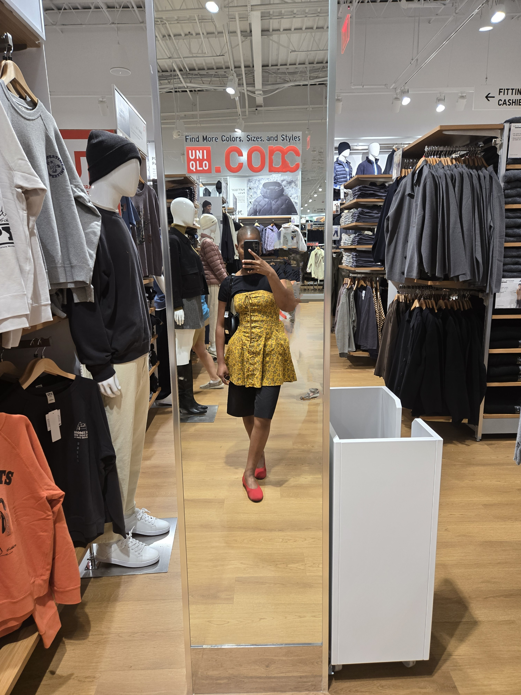
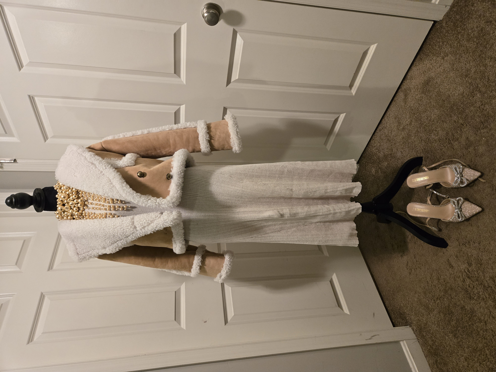

# Hi everyone, I'm Karen! 

## 💁🏾‍♀️  About Me  💁🏾‍♀️
I’m an Aircraft Electrical and Environmental Systems Engineer in the Air Force Reserves, where I’m entrusted with the vital task of maintaining the electrical and environmental systems of aircraft. My role involves troubleshooting, removing and replacing malfunctioning components, and performing cryogenic maintenance on mobile aircraft servicing units. Every opportunity I have to be an aircraft maintainer brings new challenges, and I thrive on resolving complex problems and contributing to the safety and efficiency of the aircraft I work with.

I have a deep passion for staying on the cutting edge of technology while serving others. The thrill of solving problems and seeing the solutions unfold before my eyes is what drives me. Whether it's ensuring aircraft systems run smoothly or building something from scratch, I'm always excited for the next challenge.

## 💡 Beyond Engineering 💡
When I’m not diving into the intricacies of engineering or programming, I’m exploring other areas of my life that keep me inspired. I’m passionate about faith and fashion. I enjoy listening to Christian music and watching podcasts to enrich my spiritual life. My favorite podcasts are In Totality - Megan Ashley, With the Perry's, and Give Me and Answer with Cliffe Knechtle. I also love exploring new DIY projects like crocheting, knitting, and experimenting with fashion styling. For me, fashion isn’t just about clothes—it’s a creative outlet that helps me express myself in unique git ways.

Another big passion of mine is travel. So far, I’ve visited six countries, with many more on my list. I’m always eager to dive into new cultures, connect with people, try new foods, and experience life through a different lens. 

## 👩🏾‍💻 How I Work 👩🏾‍💻
I’m a creative thinker who thrives in collaborative environments. Whether I’m working solo or as part of a team, I always give my best and strive for continuous improvement. I believe that learning is a lifelong journey, and I’m always excited to connect with others to share knowledge, tackle challenges, and grow together.

## 📧 Best Way to Reach Me 📧
I typically prefer if people come up to me and talk to reach out. I love conversing and getting to know people. However, email is typically the best way to reach me. I’m pretty responsive and check my inbox regularly.

My email: krnalabi@gmail.com

If you’re on LinkedIn, feel free to connect! I’m always open to professional networking.

My Linkedin: https://www.linkedin.com/in/karen-alabi-9b03b1215/

** Note: If you can't reach me in person or through my email, I am reachable via text message.

## 🌅 My Routine 🌅
Typically, I start each day with morning prayer and bible study. After that, I dive into my favorite part of my routine -- getting dressed. I find that the best outfits I wear are usually the most spontaneous ones and the ones with a pop of color.

I would say I am NOT a morning person, so I usually start to function best at around 1 pm. That's when I'm at my peak in terms of productivity.

Once I get settled at work, I typically grab my hot Vanilla Chai Latte. It's is my go-to and favorite drink. It is a must—especially on those busy days! I love tea, so if I dont typically have a chai latte, some sort of non-caffeinated tea is in my cup.

## 🤩 Fun Facts 🤩
-  My favorite color is green!

I would definitely describe myself as a creative and I always see the beauty in everything. I can find inspiration from just about anywhere.

- I've visited the Eiffel Tower!

I’m a travel enthusiast and I’m always looking for my next destination to explore. My favorite place I've been to is Paris, France. The bread is sooo good there!

- I can speak Mandarin!

I’m constantly learning and currently diving into learning new things. Since I was an early teenager, I've been teaching myself several langauges. I have recently dove back into learning Mandarin. It's one of my favorite langauges to learn.

### Photo Gallery

Outifts 

 

Travel 

